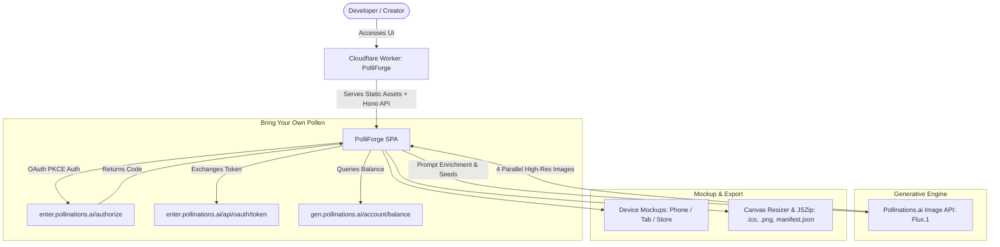

<div align="center">

# 🔥 PolliForge

### AI-Powered App Icon & Brand Asset Studio for Developers
### Estúdio de Ícones de Aplicativos e Assets de Marca com IA para Desenvolvedores

[](https://deploy.workers.cloudflare.com/?url=https://github.com/elitedrive/PolliForge)
[](https://www.typescriptlang.org/)
[](https://workers.cloudflare.com/)
[](https://hono.dev/)
[](https://pollinations.ai/)
[](https://pollinations.ai/)
[](LICENSE)

**[🇺🇸 English](#english) · [🇧🇷 Português](#portugues)**

</div>

---

<a id="english"></a>
# 🇺🇸 English

## ✨ Overview

**PolliForge** is an open-source, edge-native web application tailored for developers, indie hackers, and creators who need beautiful, production-ready app icons and brand assets in seconds.

Built entirely on top of **[Pollinations.ai](https://pollinations.ai)** generative models, PolliForge combines optimized prompt engineering with **Flux.1 Schnell / Realism** to craft centered, crisp glyphs. It features real-time device mockups (iPhone/Android homescreen, browser tab favicon, and App Store preview card) and a 1-click **Developer Bundle (.ZIP)** exporter.

### 🌟 Key Features
- **🚀 4-Icon Parallel Synthesis:** Generates 4 distinct variations per run with seed diversity and high-contrast negative prompting.
- **🎨 6 Handcrafted Design Styles:**
  - `iOS 3D Glassmorphism` (Frosted depth, subtle glow, squircle)
  - `Minimalist Flat Vector` (Modern clean geometric glyph)
  - `Cyberpunk Neon` (Synthwave glowing circuits & plasma)
  - `16-Bit Retro Pixel` (Arcade nostalgia, crisp isometric)
  - `Geometric Monogram` (Architectural typography & luxury tech)
  - `Playful 3D Clay` (Soft tactile mascot & rounded friendly shapes)
- **📱 Real-Time Device Mockup Studio:**
  - Interactive Smartphone Homescreen view.
  - Browser Tab simulator with dynamic 16x16 / 32x32 Favicon.
  - App Store / GitHub README showcase card.
- **📦 1-Click Developer Bundle (.ZIP):** Client-side Canvas rendering that packages:
  - `icon-512x512.png`
  - `icon-192x192.png`
  - `apple-touch-icon.png` (180x180)
  - `favicon.png` (32x32)
  - `site.webmanifest` (Pre-configured Web App Manifest)
  - `HTML-HEAD-SNIPPET.html` (Copy-paste `<link>` tags)
- **⚡ Bring Your Own Pollen (BYOP) & OAuth 2.0 PKCE:** Connects directly with [enter.pollinations.ai](https://enter.pollinations.ai) to allow users to spend their own Pollen balance with transparent consumption.
- **🌐 100% Serverless Edge Architecture:** Deploys instantly to Cloudflare Workers with zero infrastructure cost and instant global TTFB.

---

## 🛠️ Architecture



---

## 🚀 Quick Start (Local Development)

### Prerequisites
- Node.js `v18+` or `v24+`
- npm `v9+`

```bash
# Clone the repository
git clone https://github.com/elitedrive/PolliForge.git
cd PolliForge

# Install dependencies
npm install

# Start local Cloudflare Workers development server
npm run dev
```

Open [http://localhost:8787](http://localhost:8787) in your browser.

---

## ☁️ Deployment to Cloudflare Workers

### 1-Click CLI Deploy
```bash
# Login to Cloudflare
npx wrangler login

# Deploy directly to your Cloudflare account
npm run deploy
```

### Configuring Publishable App Key (BYOP)
To enable official Pollinations attribution and earn developer markup:
1. Go to [enter.pollinations.ai/keys](https://enter.pollinations.ai/keys).
2. Click **Create New App Key**:
   - Set **Name**: `PolliForge`
   - Set **Type**: `publishable`
   - Set **Redirect URI**: `https://polliforge.<your-subdomain>.workers.dev`
   - Enable **Developer Earnings** (`earningsEnabled: true`)
3. Copy your `pk_...` App Key and add it to `wrangler.jsonc` or set as variable:
```bash
npx wrangler secret put POLLINATIONS_APP_KEY
```

---

<a id="portugues"></a>
# 🇧🇷 Português

## ✨ Visão Geral

O **PolliForge** é uma aplicação web moderna, serverless e de código aberto criada especialmente para desenvolvedores que precisam de logos, ícones de aplicativo e favicons prontos para produção em segundos.

Construído sobre a infraestrutura de inteligência artificial da **[Pollinations.ai](https://pollinations.ai)**, o PolliForge une engenharia de prompt avançada ao modelo de geração de imagens **Flux.1** para entregar ícones centralizados, nítidos e padronizados. Ele oferece estúdio de mockups em tempo real (tela de celular, aba de navegador e card da App Store) e exportação em 1 clique de um **Developer Bundle completo em `.ZIP`**.

### 🌟 Destaques
- **🚀 4 Ícones em Paralelo:** Gera 4 opções simultâneas com seeds variadas e prompts negativos refinados.
- **🎨 6 Estilos Visuais Consagrados:**
  - `iOS 3D Glassmorphism` (Camadas translúcidas, brilho suave, squircle)
  - `Minimalist Flat Vector` (Glifo geométrico moderno estilo SaaS)
  - `Cyberpunk Neon` (Circuitos e plasma brilhantes synthwave)
  - `16-Bit Retro Pixel` (Pixel art clássico e nostálgico)
  - `Geometric Monogram` (Tipografia arquitetônica e luxo tech)
  - `Playful 3D Clay` (Mascotes e formas táteis arredondadas)
- **📱 Estúdio de Mockups Interativo:**
  - Simulação de tela de smartphone (iOS / Android).
  - Simulação de navegador com Favicon dinâmico na aba.
  - Card estilizado de apresentação para App Store / GitHub.
- **📦 Pacote de Ícones Completo (.ZIP):** Renderização via Canvas no navegador que gera:
  - `icon-512x512.png`
  - `icon-192x192.png`
  - `apple-touch-icon.png` (180x180)
  - `favicon.png` (32x32)
  - `site.webmanifest` (Manifesto PWA pronto)
  - `HTML-HEAD-SNIPPET.html` (Tags `<link>` prontas para copiar)
- **⚡ Suporte Oficial ao BYOP (Bring Your Own Pollen):** Conexão via OAuth 2.0 PKCE direto com a Pollinations, permitindo que cada usuário gaste seus próprios Pólens e acompanhe seu saldo em tempo real.

---

## 📄 Licença
Este projeto é distribuído sob a licença [MIT](LICENSE).
Sinta-se livre para usar, estudar e customizar!

---

<div align="center">
  <sub>Powered by <a href="https://pollinations.ai">Pollinations.ai</a> • Open source AI ecosystem</sub>
</div>
